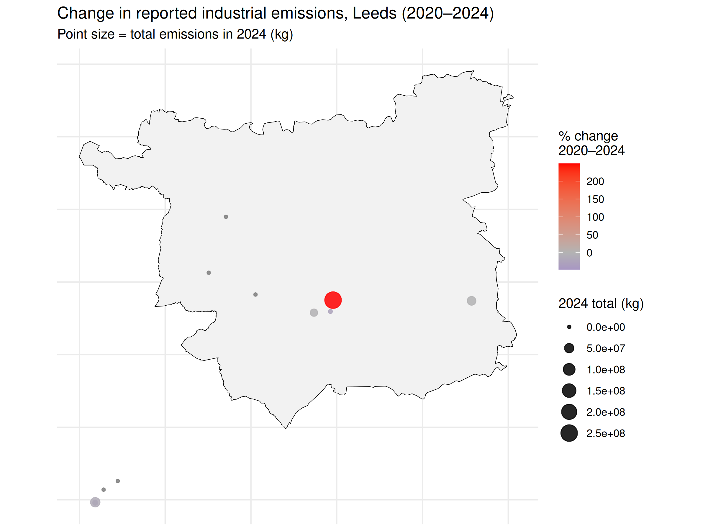

# Industrial Emissions in Leeds (2020–2024)

## Question
Has reported industrial pollution in Leeds increased or decreased between 
2020 and 2024, and is it evenly spread across the city or concentrated at 
specific sites?

## Data
- Environment Agency Pollution Inventory, 2020 and 2024 (data.gov.uk)
- ONS Local Authority District boundaries (Open Geography Portal)

## Method
Filtered the national dataset to sites in Leeds, converted and summed each 
company's total reported emissions (kg) per year, calculated percentage 
change, and mapped site locations against a boundary of Leeds using R 
(dplyr, sf, ggplot2).

## Findings

- 14 large regulated industrial sites in Leeds reported emissions in 2020 
  and/or 2024.
- Most sites' reported emissions stayed flat or declined (e.g. Syngenta 
  Limited, -47%).
- One site, Veolia ES Leeds Ltd, increased sharply (+249%), standing out as 
  both the largest and fastest-growing emitter in the dataset.
- Emissions are geographically concentrated rather than evenly spread 
  across the city.

## Limitations
- Only covers large, regulated sites — excludes smaller polluters.
- A rise in reported kg doesn't necessarily mean greater environmental 
  harm, since different substances vary in toxicity.
- The Veolia increase warrants further investigation (e.g. permit changes, 
  increased processing volume) rather than assuming worse practice.

## Files
- `leeds_pollution_analysis_final.R` / 'project.Rproj' — full analysis script
- `leeds_emissions_map.png` — final map
